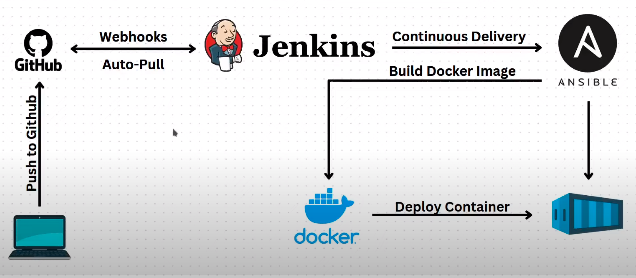
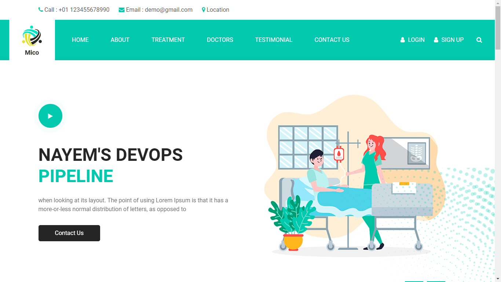
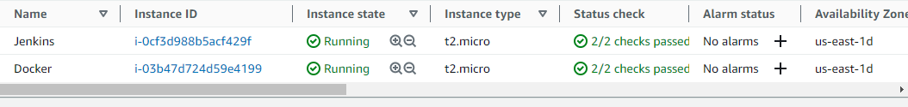
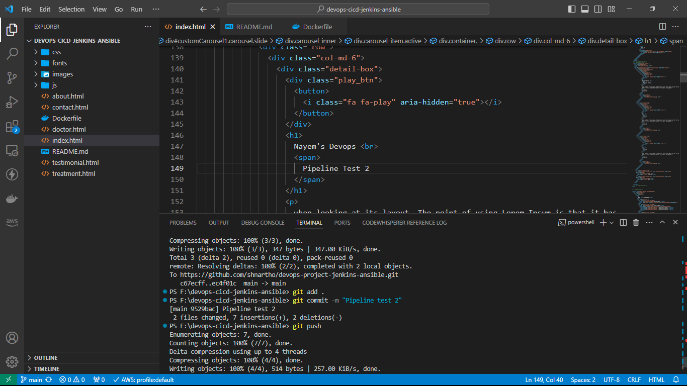
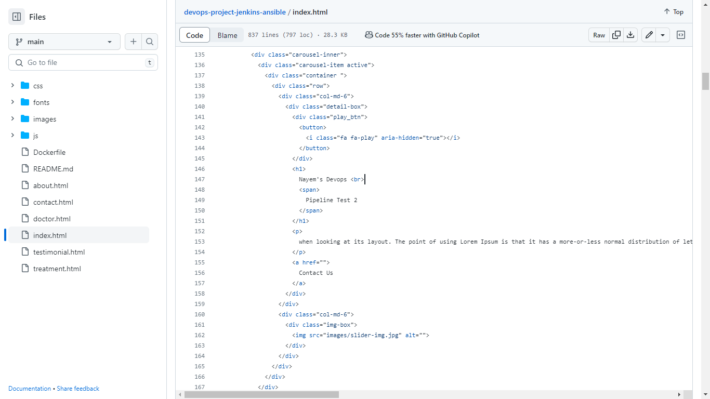
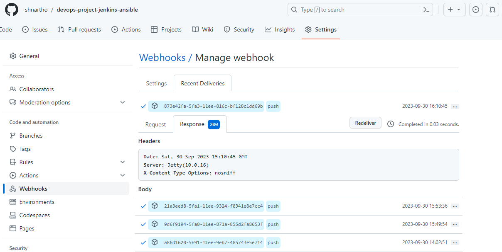
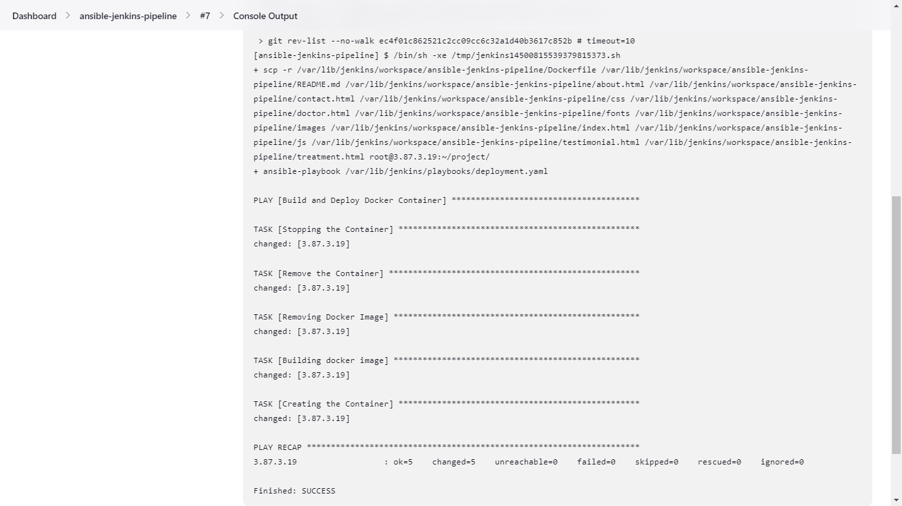
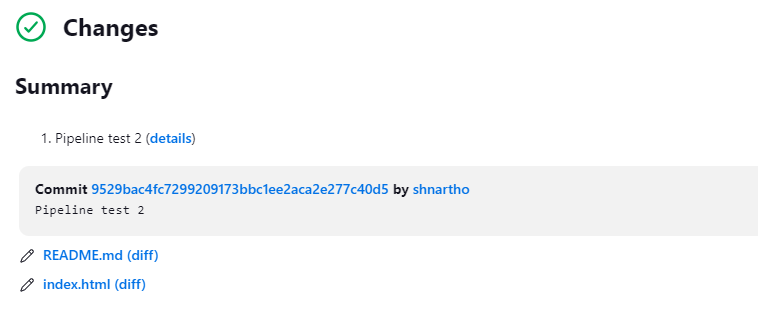
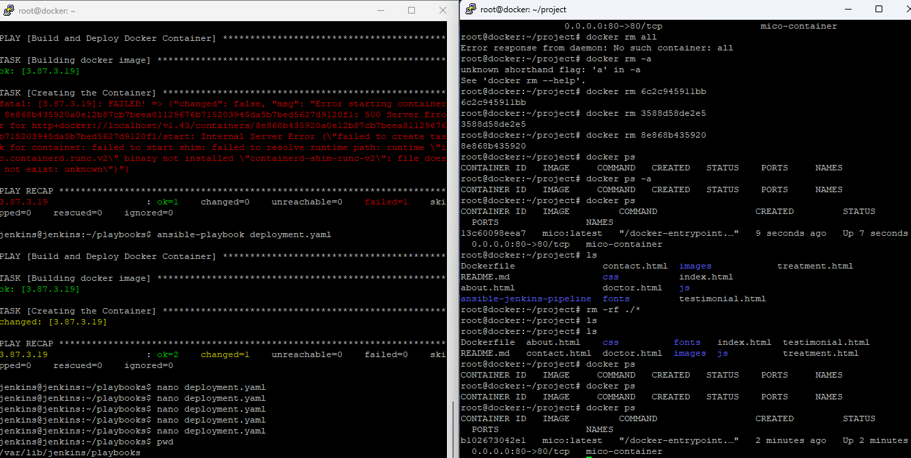
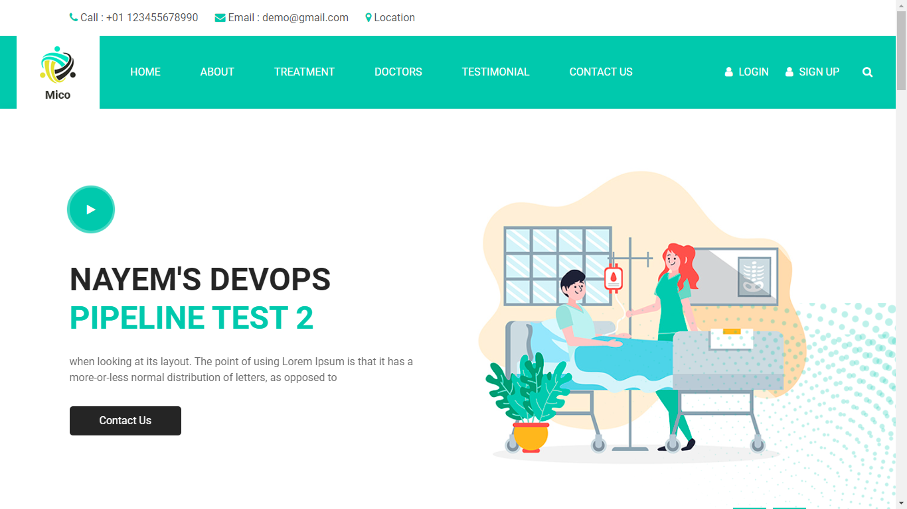

## An Agile DevOps Project: Building a Jenkins CI/CD Pipeline with Ansible, Docker, GitHub Webhooks, and AWS✌️

### 🔰 Overview 

#### 🟢 The website is running from docker container. Updating the code repository will automatically update the docker image and container and the changes will be visible immediately.

#### 🟢 Both jenkins, ansible server and docker server in running state

#### 🟢 Lets update the codebase and push it to the repository

#### 🟢 The code repository has been updated

#### 🟢 Update got triggered by the github webhook

#### 🟢 Jenkins pull the changes and rebuild the docker image and container

#### 🟢 Jenkins build success

#### 🟢 New docker container is now running

#### 🟢 After browsing dockerserverip:port, we can confirm that the changes automatically updated in the index page. 

### 🖥️ Servers Setup 
1. EC2: To connect using aws ec2 instances, first check if "etc/ssh/sshd_config -> PasswordAuthentication yes", incase it is set to no then change it to yes otherwise using putty you cant connet to the ec2 instances. After that restart sshd. After setting up jenkins, ansible and docker server, make sure ansible can ssh docker without password to run ansible playbook automatically.
1. Jenkins: Install java runtime environment. For Jenkins installing follow https://www.jenkins.io/doc/book/installing/linux/. In jenkins pipeline, use source code git with github hook trigger and build step execute shell comand "scp -r /var/lib/jenkins/workspace/ansible-jenkins-pipeline/* root@{ip}:~/project/
ansible-playbook /var/lib/jenkins/playbooks/deployment.yaml"
3. Docker: To run docker container in t2.micro aws, install "sudo apt-get install containerd", "sudo systemctl start containerd" and "sudo systemctl enable containerd". For Docker installation follow https://docs.docker.com/engine/install/ubuntu/. After installing add user to docker group using "sudo usermod -aG docker $username" and refresh group using "newgrp docker" then you can use docker commands without error. Also to make sure ansible can ssh to docker server I need run "ssh-keygen", and then add ssh public key of ansible server from ~/.ssh/id_rsa.pub to the ~/.ssh/authorized_keys in docker server. Also set PermitRootLogin yes in sshd_config. Make 
4. Ansible: For Ansible installation follow https://docs.ansible.com/ansible/latest/installation_guide/installation_distros.html#installing-ansible-on-ubuntu. Then run "pip install docker". /etc/ansible/hosts and add servers "[Groupname] \nip of the servers"

🎯 In summary, Updating code repository will trigger repository webhook which follows event driven architecture and send request to jenkins server. Jenkins server will pull the repo, copy and paste the repo to docker server and also execute ansible-playbook commnad. As the instruction defined in the deployment.yaml file for ansible and etc/ansible/hosts file contains the docker server ip and as we generated ssh-keygen of ansible server, put it in docker server ~/.ssh/authorized_keys, therefore, ansible will automatically stop, remove, build and create
docker images/containers. As port 80 is forworded from the container to the docker host server, we need to browse dockerserverip:port to view the changes. 
